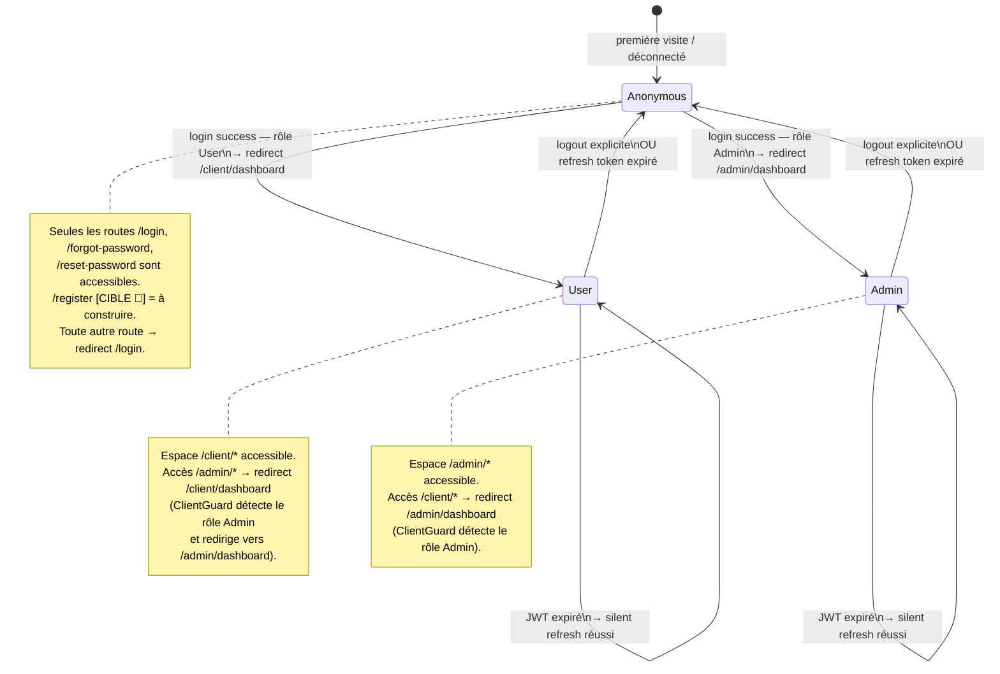
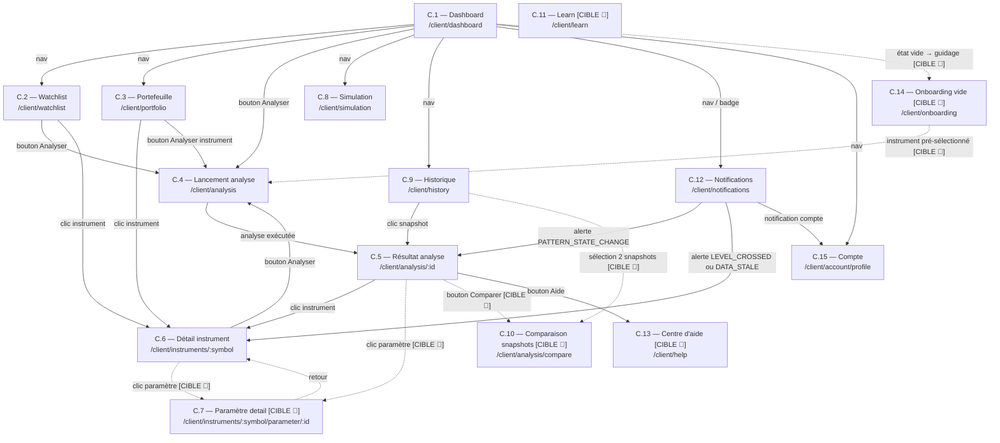
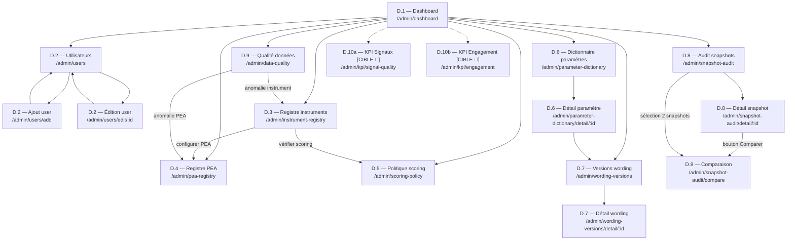

# 11 — Carte de navigation et parcours (V1)

> **Propriétaire de** : registre exhaustif des routes, machine d'état d'authentification, diagrammes de navigation par espace, règles de guard/redirect, routage des notifications, et parcours par persona. Ce document **relie les écrans** ([03](03_specification_ecrans.md)) aux **flux** ([07](07_flux_metier_client_admin.md)) du point de vue de la navigation — il ne décrit pas les étapes internes des flux.
>
> **À qui s'adresse ce document** : équipe produit (comprendre les chemins possibles), équipe technique (implémenter les guards et la navigation), agents IA (raisonner sur les transitions écrans sans ambiguïté).

---

## A. Conventions

| Symbole | Signification |
|---|---|
| 🟢 | Route/écran construit et fonctionnel |
| 🟡 | Route construite, écran partiellement implémenté |
| `[CIBLE 🔴]` | Route ou écran documenté en cible mais **non construit** |
| ~~`[AMBIGU A-01]`~~ | Ambiguïté fermée — `Admin` est l'unique rôle d'accès à `/admin/*`. Voir [10 §E](10_personas.md#e-persona-a01--ladministrateur). |
| `→` | Transition directe (lien, bouton, redirect) |
| `⟶` | Transition conditionnelle (guard, état) |
| `FLUX-C-xx` / `FLUX-A-xx` | Référence à un flux dans [07](07_flux_metier_client_admin.md) |
| `PERSONA-xxx` | Référence à un profil dans [10](10_personas.md) |

---

## B. Machine d'état d'authentification

La machine d'état ci-dessous gouverne toute la navigation. Elle est implémentée par les guards Angular (`AuthGuard`, `ClientGuard`, `AdminGuard` dans `FinanceFront/src/app/guard/`).



### B.1 Comportement du wildcard

La route `**` dans `app.routes.ts` redirige vers `/login`. Toute URL inconnue aboutit donc à `/login`, ce qui couvre les liens profonds invalides ou les URLs mal formées.

---

## C. Registre des routes

Table exhaustive de toutes les routes de l'application. Les routes `[CIBLE 🔴]` sont documentées pour la cible V1 même si non construites.

### C.1 Espace Anonymous

| Path | Spec | Statut | Guard | Entrées | Sorties | FLUX-ref |
|---|---|---|---|---|---|---|
| `/login` | B.1 | 🟢 | Aucun (public) | Wildcard `**`, liens depuis app, retour après auth | `/forgot-password`, `/client/dashboard` (User), `/admin/dashboard` (Admin) | FLUX-C-02 |
| `/forgot-password` | B.2 | 🟢 | Aucun (public) | Lien depuis B.1 | B.1 (après envoi email) | FLUX-C-03 |
| `/reset-password` | B.3 | 🟢 | Aucun (public) | Lien dans email de reset | B.1 (après reset réussi) | FLUX-C-03 |
| `/register` `[CIBLE 🔴]` | B.4 | 🔴 | Aucun (public) | Lien CTA depuis B.1 | B.1 (après confirmation email) | FLUX-C-01 |

### C.2 Espace Client (`/client/*`)

Guards : `AuthGuard` + `ClientGuard`
- `AuthGuard` : pas de token valide → redirect `/login`
- `ClientGuard` : token valide + rôle `Admin` → redirect `/admin/dashboard`

| Path | Spec | Statut | Entrées | Sorties | FLUX-ref |
|---|---|---|---|---|---|
| `/client` | — | 🟢 | — | Redirect → `/client/dashboard` | — |
| `/client/dashboard` | C.1 | 🟢 | Login success (User), nav globale, liens directs | C.2, C.3, C.4, C.9, C.12, C.8, C.14 🔴 | FLUX-C-04, FLUX-C-05 |
| `/client/watchlist` | C.2 | 🟢 | C.1, nav latérale | C.4 (pré-rempli), C.6 | FLUX-C-05 |
| `/client/portfolio` | C.3 | 🟢 | C.1, nav latérale | C.6, C.4 | FLUX-C-06 |
| `/client/analysis` | C.4 | 🟢 | C.1, C.2 (pré-rempli), C.14 🔴 (pré-rempli) | C.5 après soumission | FLUX-C-07 |
| `/client/analysis/:analysisId` | C.5 | 🟡 | C.4 (après exécution), C.9 (historique), C.12 (alerte) | C.6, C.7 🔴, C.4 (relancer), C.10 🔴 | FLUX-C-08 |
| `/client/history` | C.9 | 🟢 | C.1, nav latérale | C.5 (détail snapshot), C.10 🔴 (comparaison) | FLUX-C-09 |
| `/client/simulation` | C.8 | 🟢 | C.1, nav latérale | C.4 (si l'utilisateur veut confirmer) | — |
| `/client/instruments/:symbol` | C.6 | 🟢 | C.5, C.2, C.3 | C.4 (relancer analyse), C.7 🔴 | FLUX-C-08 |
| `/client/notifications` | C.12 | 🟢 | C.1 (badge), nav latérale | C.5 (alerte analyse), C.6 (alerte instrument) | FLUX-C-12 |
| `/client/account` | C.15 | 🟢 | Nav latérale | Redirect → `/client/account/profile` | — |
| `/client/account/profile` | C.15a | 🟢 | C.15 | C.15b | FLUX-C-15 |
| `/client/account/security` | C.15b | 🟢 | C.15 | C.15a | FLUX-C-15 |
| `/client/onboarding` `[CIBLE 🔴]` | C.14 | 🔴 | C.1 (détection état vide) | C.4 (pré-rempli) | FLUX-C-04 |
| `/client/help` `[CIBLE 🔴]` | C.13 | 🔴 | Nav, C.5, C.6 | C.5, C.6 (contextuel) | FLUX-C-14 |
| `/client/learn` `[CIBLE 🔴]` | C.11 | 🔴 | Nav | — | FLUX-C-14 |
| `/client/instruments/:symbol/parameter/:id` `[CIBLE 🔴]` | C.7 | 🔴 | C.5, C.6 | C.5, C.6 (retour) | — |
| `/client/analysis/compare` `[CIBLE 🔴]` | C.10 | 🔴 | C.9 (sélection 2 snapshots) | C.9 | FLUX-C-09 |

> **Note** : `/client/finance` est un alias qui redirige vers `/client/watchlist` (défini dans `app.routes.user.ts`).

### C.3 Espace Admin (`/admin/*`)

Guards : `AuthGuard` + `AdminGuard`
- `AuthGuard` : pas de token → redirect `/login`
- `AdminGuard` : token valide + rôle `User` → redirect `/client/dashboard`

| Path | Spec | Statut | Entrées | Sorties | FLUX-ref |
|---|---|---|---|---|---|
| `/admin` | — | 🟢 | — | Redirect → `/admin/dashboard` | — |
| `/admin/dashboard` | D.1 | 🟢 | Login success (Admin), nav globale | D.2–D.9, D.10 🔴 | FLUX-A-01 |
| `/admin/users` | D.2 | 🟢 | D.1, nav latérale | `/admin/users/add`, `/admin/users/edit/:id` | FLUX-A-02 |
| `/admin/users/add` | D.2 | 🟢 | D.2 | D.2 (après ajout) | FLUX-A-02 |
| `/admin/users/edit/:id` | D.2 | 🟢 | D.2 | D.2 (après modification) | FLUX-A-02 |
| `/admin/instrument-registry` | D.3 | 🟢 | D.1, nav latérale | D.4 (statut PEA), D.5 (scoring) | FLUX-A-03 |
| `/admin/pea-registry` | D.4 | 🟢 | D.1, nav latérale, D.3 | D.3 (retour) | FLUX-A-04 |
| `/admin/scoring-policy` | D.5 | 🟢 | D.1, nav latérale | D.6 (dictionnaire paramètres lié) | FLUX-A-05 |
| `/admin/parameter-dictionary` | D.6 | 🟢 | D.1, nav latérale | `/admin/parameter-dictionary/detail/:id` | FLUX-A-06 |
| `/admin/parameter-dictionary/detail/:parameterId` | D.6 | 🟢 | D.6 | D.6 (retour), D.7 (wording lié) | FLUX-A-06 |
| `/admin/wording-versions` | D.7 | 🟢 | D.1, nav latérale | `/admin/wording-versions/detail/:id` | FLUX-A-07 |
| `/admin/wording-versions/detail/:wordingVersionId` | D.7 | 🟢 | D.7 | D.7 (retour) | FLUX-A-07 |
| `/admin/snapshot-audit` | D.8 | 🟢 | D.1, nav latérale | `/admin/snapshot-audit/detail/:id`, `/admin/snapshot-audit/compare` | FLUX-A-08 |
| `/admin/snapshot-audit/detail/:analysisRunId` | D.8 | 🟢 | D.8 | D.8 (retour), `/admin/snapshot-audit/compare` | FLUX-A-08 |
| `/admin/snapshot-audit/compare` | D.8 | 🟢 | D.8, D.8 detail (bouton comparer) | D.8 (retour) | FLUX-A-08 |
| `/admin/data-quality` | D.9 | 🟢 | D.1, nav latérale | D.3 (corriger instrument), D.4 (corriger PEA) | FLUX-A-09 |
| `/admin/kpi/signal-quality` `[CIBLE 🔴]` | D.10a | 🔴 | D.1 | — | FLUX-A-10 |
| `/admin/kpi/engagement` `[CIBLE 🔴]` | D.10b | 🔴 | D.1 | — | FLUX-A-11 |

---

## D. Navigation espace Anonymous

```mermaid
flowchart TD
    Entry([Visite initiale ou URL inconnue])
    B1[B.1 — /login]
    B2[B.2 — /forgot-password]
    B3[B.3 — /reset-password]
    B4["B.4 — /register [CIBLE 🔴]"]
    Email([Email de reset ou confirmation])
    ClientDash[/client/dashboard]
    AdminDash[/admin/dashboard]

    Entry -->|"wildcard **"| B1
    B1 -->|"login success — rôle User"| ClientDash
    B1 -->|"login success — rôle Admin"| AdminDash
    B1 -->|"lien 'Mot de passe oublié'"| B2
    B1 -.->|"lien 'Créer un compte' [CIBLE 🔴]"| B4
    B2 -->|"email envoyé → retour login"| B1
    B2 -->|"lien dans email reçu"| B3
    Email -->|"lien reset"| B3
    Email -.->|"lien confirmation inscription [CIBLE 🔴]"| B4
    B3 -->|"reset réussi → retour login"| B1
    B4 -.->|"inscription réussie → retour login [CIBLE 🔴]"| B1
```

---

## E. Navigation espace Client

### E.1 Diagramme global



> **Boucle C.5 ↔ C.6** : depuis le résultat d'analyse (`C.5`) on peut accéder au détail d'un instrument (`C.6`) ; depuis l'instrument on peut relancer une nouvelle analyse (`C.4`). Ce cycle est intentionnel — il permet à l'utilisateur d'alterner lecture de contexte et analyse sans revenir au tableau de bord.

### E.2 Table des actions navigantes par écran

| Écran source | Action déclenchante | Écran cible | Condition |
|---|---|---|---|
| C.1 Dashboard | Détection état vide au chargement | C.14 🔴 Onboarding | Aucune watchlist + 0 analyse + 0 portefeuille |
| C.1 Dashboard | Clic sur badge notification | C.12 Notifications | Toujours |
| C.1 Dashboard | Clic "Analyser" | C.4 Lancement | Toujours |
| C.2 Watchlist | Clic sur un instrument | C.6 Détail instrument | Toujours |
| C.2 Watchlist | Clic "Analyser" sur un instrument | C.4 pré-rempli | Toujours |
| C.3 Portfolio | Clic sur une position | C.6 Détail instrument | Toujours |
| C.4 Lancement | Soumission formulaire analyse | C.5 Résultat | Analyse exécutée (FLUX-C-07) |
| C.5 Résultat | Clic sur le nom de l'instrument | C.6 Détail instrument | Toujours |
| C.5 Résultat | Clic sur un paramètre | C.7 🔴 Paramètre detail | Paramètre avec dict. gouverné |
| C.5 Résultat | Clic "Comparer avec…" | C.10 🔴 Comparaison | Au moins un autre snapshot existant |
| C.6 Instrument | Bouton "Nouvelle analyse" | C.4 pré-rempli | Toujours |
| C.9 Historique | Clic sur un snapshot | C.5 Résultat (lecture seule) | Toujours |
| C.9 Historique | Sélection 2 snapshots + bouton Comparer | C.10 🔴 Comparaison | Même instrument |
| C.12 Notifications | Alerte `PATTERN_STATE_CHANGE` | C.5 dernier snapshot de l'instrument | Snapshot existant |
| C.12 Notifications | Alerte `LEVEL_CROSSED` ou `DATA_STALE` | C.6 Instrument | Toujours |

---

## F. Navigation espace Admin

### F.1 Diagramme global



---

## G. Règles de navigation (guards et redirects)

Ces règles sont implémentées dans `FinanceFront/src/app/guard/`. Elles ne doivent jamais être contournées côté frontend.

| Situation | Guard | Comportement | Source code |
|---|---|---|---|
| **Anonymous** tente `/client/*` | `AuthGuard` | Redirect → `/login` | `auth.guard.ts` : token absent |
| **Anonymous** tente `/admin/*` | `AuthGuard` | Redirect → `/login` | `auth.guard.ts` : token absent |
| **User (rôle=User)** tente `/admin/*` | `AdminGuard` | Redirect → `/client/dashboard` | `admin.guard.ts` : `isAdmin=false` → `UserPaths.Dashboard` |
| **Admin** tente `/client/*` | `ClientGuard` | Redirect → `/admin/dashboard` | `client.guard.ts` : `isAdmin=true` → `AdminPaths.Dashboard` |
| **Toute URL inconnue** | Route `**` | Redirect → `/login` | `app.routes.ts` : `redirectTo: AppRoutes.Login` |
| **JWT expiré, refresh valide** | `AuthGuard` | Silent refresh → accès maintenu | `AuthService.ensureValidAccessToken()` |
| **JWT expiré, refresh expiré** | `AuthGuard` | Redirect → `/login` | `AuthService.ensureValidAccessToken()` → null |
| **Lien profond partagé sans session** | `AuthGuard` | Redirect → `/login` ; retour URL `[À IMPLÉMENTER]` | `auth.guard.ts` — pas de `returnUrl` actuellement |

### G.1 Cas non arbitrés

| Cas | Comportement actuel | Recommandation |
|---|---|---|
| **Admin** tente accès `/client/*` | Redirect `/admin/dashboard` (implémenté) | Comportement correct — conforme au rôle admin unique |
| **Retour URL après redirect login** | Non implémenté | Ajouter `?returnUrl=...` au redirect pour ne pas perdre l'intention de navigation |

---

## H. Routage des notifications (RM-23, RM-25)

RM-23 stipule que les notifications **« routent, n'expliquent pas »**. Cette section spécifie précisément vers quelle URL chaque type d'alerte dirige l'utilisateur.

### H.1 Table de routage

| Type de déclencheur (`AlertTrigger`) | Condition d'occurrence | Écran cible | Path cible | Statut écran cible |
|---|---|---|---|---|
| `PATTERN_STATE_CHANGE` | `PatternStatus` passe `Monitoring → Confirmed` ou `* → Invalidated` | C.5 Résultat analyse | `/client/analysis/:lastAnalysisId` | 🟡 |
| `LEVEL_CROSSED` | Prix franchit `TargetPrice` ou `InvalidationPrice` (éval. ex post) | C.6 Détail instrument | `/client/instruments/:symbol` | 🟢 |
| `DATA_STALE` | Fraîcheur d'un instrument suivi bascule vers `STALE` | C.6 Détail instrument | `/client/instruments/:symbol` | 🟢 |
| Notification standard (ex. confirmation transaction) | Action utilisateur confirmée | Écran source | Contextuel | Variable |
| Notification compte (ex. changement mot de passe) | Événement sécurité | C.15 Compte | `/client/account/security` | 🟢 |

### H.2 Règles d'application (RM-25b)

| Règle | Description |
|---|---|
| **Dédoublonnage** | Clé de déduplication : `(instrumentId, AlertTrigger, jour)` — une seule notification par combinaison par jour |
| **Respect des préférences** | Chaque déclencheur peut être désactivé par l'utilisateur dans C.15 (FLUX-C-15 sous-flux B) |
| **Écran cible non construit** | Si l'écran cible est `[CIBLE 🔴]`, la notification est **affichée** dans C.12 mais le lien de navigation est désactivé (`disabled`) — jamais de lien cassé |
| **Route, n'explique pas** | La notification indique l'instrument et le type d'événement ; elle **ne reproduit pas** l'analyse ni la confiance |

---

## I. Parcours par persona (11 parcours)

Un parcours est une séquence d'écrans traversée par un persona pour atteindre un objectif. Chaque parcours référence les flux détaillés dans [07](07_flux_metier_client_admin.md).

**Format** :
```
ID — Nom du parcours
Persona      : PERSONA-xxx
Précondition : état requis
Objectif     : ce que l'utilisateur veut accomplir
Étapes       : [Écran] action → [Écran suivant]
FLUX-ref     : flux détaillés dans 07
Issues       : succès / abandon / erreur
```

---

### PARCOURS-ANON-01 — Découverte et inscription

```
Persona      : PERSONA-ANON
Précondition : aucune session active, première visite
Objectif     : créer un compte pour utiliser l'application
État actuel  : [BLOQUÉ — B.4 /register non construit]
```

| # | Écran | Action | Écran suivant |
|---|---|---|---|
| 1 | B.1 `/login` 🟢 | Arrive sur la page de connexion | B.1 |
| 2 | B.1 `/login` 🟢 | Cherche un CTA "Créer un compte" | B.4 🔴 (inexistant) |
| 3 | B.4 `/register` 🔴 | Remplit email + mot de passe + coche CGU | B.1 (email de confirmation envoyé) |
| 4 | Email reçu | Clique sur le lien de confirmation | B.4 activation (ou B.1 directement) |
| 5 | B.1 `/login` 🟢 | Se connecte avec les nouveaux identifiants | C.1 `/client/dashboard` |

**FLUX-ref** : FLUX-C-01 🔴, FLUX-C-02

**Issues** :
- ✅ **Succès** : compte actif, routé vers `/client/dashboard`, FLUX-C-04 déclenché
- ❌ **Abandon actuel** : B.4 absent → l'utilisateur ne peut pas s'inscrire en autonomie
- ⚠️ **Erreur** : email déjà utilisé → message générique sans révéler existence du compte

---

### PARCOURS-U01-01 — Onboarding → première analyse

```
Persona      : PERSONA-U01 (L'Investisseur Découvrant)
Précondition : session active (User), 0 watchlist, 0 portefeuille, 0 analyse
Objectif     : comprendre une première action française et lancer une analyse
Dépend de    : C.14 /client/onboarding [CIBLE 🔴]
```

| # | Écran | Action | Écran suivant |
|---|---|---|---|
| 1 | C.1 `/client/dashboard` 🟢 | Arrivée post-login, home vide détectée | C.14 🔴 (redirect automatique) |
| 2 | C.14 `/client/onboarding` 🔴 | Affichage exemples d'actions (TotalEnergies, LVMH, L'Oréal) | C.14 |
| 3 | C.14 🔴 | Clique sur un exemple ou saisit manuellement un symbole | C.4 pré-rempli |
| 4 | C.4 `/client/analysis` 🟢 | Contexte `NOT_HELD` pré-sélectionné, lance l'analyse | C.5 |
| 5 | C.5 `/client/analysis/:id` 🟡 | Lit le résultat : pattern, confiance, recommandation | C.5 |
| 6 | C.5 🟡 | Accepte la proposition d'ajouter à la watchlist | C.2 watchlist +1 |

**FLUX-ref** : FLUX-C-04 🔴, FLUX-C-07, FLUX-C-05

**Issues** :
- ✅ **Succès** : snapshot persisté, watchlist +1, U01 comprend son premier résultat
- ❌ **Décrochage actuel** : C.14 absent → home vide sans guidage → abandon J+1
- ⚠️ **Issue non-exécutable** : si `NoCrediblePattern`, C.5 affiche l'état sans paniquer (plan d'action adapté)

---

### PARCOURS-U01-02 — Ajouter un premier instrument à la watchlist

```
Persona      : PERSONA-U01 (ou PERSONA-U02)
Précondition : session active (User)
Objectif     : surveiller une action française sans l'avoir analysée
```

| # | Écran | Action | Écran suivant |
|---|---|---|---|
| 1 | C.1 ou C.2 | Clique sur "Ajouter" dans la watchlist | C.2 (modale de recherche) |
| 2 | C.2 `/client/watchlist` 🟢 | Saisit un nom ou ticker | C.2 (liste filtrée) |
| 3 | C.2 🟢 | Sélectionne un instrument | C.2 watchlist +1 |
| 4 | C.2 🟢 | (Optionnel) Clique sur l'instrument ajouté | C.6 Détail instrument |

**FLUX-ref** : FLUX-C-05 sous-flux A

**Issues** :
- ✅ **Succès** : instrument dans watchlist, visible sur C.1 et C.2
- ⚠️ **Hors périmètre** : instrument non FR, ETF ou crypto → message `UnsupportedInstrument` (RM-24)

---

### PARCOURS-U02-01 — Session quotidienne (alertes → analyse → décision)

```
Persona      : PERSONA-U02 (L'Investisseur Actif)
Précondition : session active, positions existantes, notifications en attente
Objectif     : traiter une alerte et décider d'une action sur sa position
```

| # | Écran | Action | Écran suivant |
|---|---|---|---|
| 1 | C.1 `/client/dashboard` 🟢 | Voit le badge de notification | C.12 Notifications |
| 2 | C.12 `/client/notifications` 🟢 | Liste des alertes triées par priorité | C.12 |
| 3 | C.12 🟢 | Clique sur alerte `PATTERN_STATE_CHANGE` | C.5 `/client/analysis/:lastId` |
| 4 | C.5 🟡 | Lit le résultat mis à jour (pattern confirmé) | C.5 |
| 5 | C.5 🟡 | Décide de relancer une analyse fraîche | C.4 pré-rempli avec instrument + HELD |
| 6 | C.4 🟢 | Lance la nouvelle analyse | C.5 nouveau snapshot |
| 7 | C.5 🟡 | Prend une décision → enregistre la transaction | C.3 Portfolio |

**FLUX-ref** : FLUX-C-12, FLUX-C-07, FLUX-C-08, FLUX-C-06

**Issues** :
- ✅ **Succès** : décision éclairée prise en < 15 min, snapshot persisté
- ⚠️ **Fatigue d'alertes** : si trop de notifications peu importantes → U02 désactive les préférences dans C.15

---

### PARCOURS-U02-02 — Analyse complète (instrument détenu, lecture support + PEA)

```
Persona      : PERSONA-U02
Précondition : instrument dans portefeuille (contexte HELD), données fondamentales disponibles
Objectif     : analyse complète des 4 lectures + plan d'action + confiance expliquée
```

| # | Écran | Action | Écran suivant |
|---|---|---|---|
| 1 | C.3 `/client/portfolio` 🟢 | Clique sur une position détenue | C.6 Instrument detail |
| 2 | C.6 `/client/instruments/:symbol` 🟢 | Lit le score fondamental et le statut PEA | C.6 |
| 3 | C.6 🟢 | Clique "Analyser" | C.4 pré-rempli (HELD, instrument) |
| 4 | C.4 `/client/analysis` 🟢 | Lance l'analyse | C.5 |
| 5 | C.5 🟡 | Lit les 4 lectures séparées | C.5 |
| 6 | C.5 🟡 | Lit le plan d'action (`[CIBLE 🔴]`) et la confiance expliquée (`[CIBLE 🔴]`) | C.5 |
| 7 | C.5 🟡 | Clique sur un paramètre inconnu | C.7 🔴 (4 couches pédagogiques) |
| 8 | C.7 🔴 | Retour vers le résultat | C.5 |

**FLUX-ref** : FLUX-C-07, FLUX-C-08 (RM-09, RM-10, RM-12, RM-16, RM-26, RM-27)

**Issues** :
- ✅ **Succès** : U02 comprend les 4 lectures et a un plan d'action concret
- ❌ **Moat manquant** : plan d'action et confiance expliquée non construits → expérience incomplète `[CIBLE 🔴]`

---

### PARCOURS-U02-03 — Enregistrer une transaction + impact contexte détention

```
Persona      : PERSONA-U02
Précondition : session active, instrument en watchlist ou portefeuille
Objectif     : enregistrer un achat, voir le PRU mis à jour, relancer une analyse en contexte HELD
```

| # | Écran | Action | Écran suivant |
|---|---|---|---|
| 1 | C.3 `/client/portfolio` 🟢 | Clique "Nouvelle transaction" | C.3 (formulaire) |
| 2 | C.3 🟢 | Saisit instrument, quantité, prix unitaire, frais, date | C.3 |
| 3 | C.3 🟢 | Soumet → système recalcule FIFO → PRU mis à jour | C.3 (lignes ouvertes actualisées) |
| 4 | C.3 🟢 | Clique sur la nouvelle position | C.6 Instrument detail |
| 5 | C.6 🟢 | Lance une analyse sur l'instrument | C.4 (contexte HELD automatiquement détecté) |
| 6 | C.4 🟢 | Lance → recommandation adaptée au contexte HELD | C.5 résultat contextualisé |

**FLUX-ref** : FLUX-C-06, FLUX-C-07 (RM-08, RM-08b, RM-09, RM-10)

**Issues** :
- ✅ **Succès** : PRU correct, contexte HELD reconnu, verbes recommandation corrects (`Hold/Reinforce/Lighten/Sell/Wait`)
- ⚠️ **Attention** : reconstruction FIFO côté système — l'utilisateur doit saisir les données chronologiquement

---

### PARCOURS-U02-04 — Comparer deux snapshots (historique)

```
Persona      : PERSONA-U02
Précondition : au moins 2 analyses persistées sur le même instrument
Objectif     : comprendre ce qui a changé entre deux analyses
Dépend de    : C.10 /client/analysis/compare [CIBLE 🔴]
```

| # | Écran | Action | Écran suivant |
|---|---|---|---|
| 1 | C.9 `/client/history` 🟢 | Filtre par instrument | C.9 |
| 2 | C.9 🟢 | Sélectionne un premier snapshot | C.5 (lecture seule, snapshot A) |
| 3 | C.5 🟡 | Clique "Comparer avec…" | C.10 🔴 |
| 4 | C.10 🔴 | Sélectionne le second snapshot (B) | C.10 🔴 |
| 5 | C.10 🔴 | Lit le diff : pattern avant/après, reco avant/après, confiance avant/après | C.10 🔴 |

**FLUX-ref** : FLUX-C-09 (RM-19, RM-20)

**Issues** :
- ❌ **Bloqué** : C.10 non construit → parcours incomplet
- ✅ **Invariant à respecter** : la comparaison lit les snapshots persistés — jamais de recalcul (RM-20)

---

### PARCOURS-A01-01 — Contrôle qualité quotidien

```
Persona      : PERSONA-A01 (L'Administrateur)
Précondition : session active (Admin), données potentiellement dégradées
Objectif     : s'assurer qu'aucune anomalie critique n'est passée inaperçue
```

| # | Écran | Action | Écran suivant |
|---|---|---|---|
| 1 | D.1 `/admin/dashboard` 🟢 | Vérifie le résumé des anomalies (cartes quick-view) | D.1 |
| 2 | D.1 🟢 | Voit une anomalie de qualité → clique sur la carte | D.9 Data quality |
| 3 | D.9 `/admin/data-quality` 🟢 | Trie par criticité (STALE, MISSING) | D.9 |
| 4 | D.9 🟢 | Ouvre une anomalie → identifie l'instrument concerné | D.3 ou D.4 |
| 5 | D.3 `/admin/instrument-registry` 🟢 | Corrige les métadonnées ou déclenche une re-sync | D.3 |
| 6 | D.9 🟢 | Marque l'anomalie comme traitée | D.9 (0 anomalie critique) |

**FLUX-ref** : FLUX-A-09 🔴, FLUX-A-03 🔴

**Issues** :
- ✅ **Succès** : 0 anomalie rouge, tous les instruments actifs en `FRESH` ou `AGING`
- ⚠️ **Risque** : données stale non détectées → analyses utilisateurs basées sur données obsolètes

---

### PARCOURS-A01-02 — Ajouter et configurer un instrument

```
Persona      : PERSONA-A01
Précondition : session active (Admin), instrument à référencer dans le périmètre V1
Objectif     : intégrer un instrument correctement (registre + PEA + scoring)
```

| # | Écran | Action | Écran suivant |
|---|---|---|---|
| 1 | D.3 `/admin/instrument-registry` 🟢 | Clique "Ajouter" | D.3 (formulaire) |
| 2 | D.3 🟢 | Saisit symbol, nom, `AssetType=Stock`, `countryCode=FR`, `isActive=true` | D.3 |
| 3 | D.3 🟢 | Confirme la création | D.3 (instrument créé) |
| 4 | D.4 `/admin/pea-registry` 🟢 | Définit le statut PEA : `ConfirmedEligible`, `ConfirmedIneligible` ou `Unknown` | D.4 |
| 5 | D.5 `/admin/scoring-policy` 🟢 | Vérifie que l'instrument est inclus dans l'univers de scoring | D.5 |
| 6 | Vérification | Lance une analyse de test depuis un compte utilisateur de test | C.5 |

**FLUX-ref** : FLUX-A-03 🔴, FLUX-A-04 🔴, FLUX-A-05 🔴 (RM-04, RM-13, RM-15)

**Issues** :
- ✅ **Succès** : instrument disponible en V1, analyses exécutables, PEA non ambigu
- ⚠️ **Risque** : PEA laissé à `Unknown` → score composite bloqué pour cet instrument (RM-14, RM-15)

---

### PARCOURS-A01-03 — Publier une mise à jour de wording

```
Persona      : PERSONA-A01
Précondition : session active (Admin), wording existant à réviser
Objectif     : mettre à jour les 4 couches d'un paramètre sans casser l'historique des snapshots
```

| # | Écran | Action | Écran suivant |
|---|---|---|---|
| 1 | D.6 `/admin/parameter-dictionary` 🟢 | Trouve le paramètre à modifier | D.6 |
| 2 | D.6 detail `/admin/parameter-dictionary/detail/:id` 🟢 | Lit les 4 couches actuelles | D.6 detail |
| 3 | D.6 detail 🟢 | Modifie : définition, lecture valeur, pourquoi ça compte, implication pour moi | D.6 detail |
| 4 | D.7 `/admin/wording-versions` 🟢 | Crée une nouvelle version (incrémente `policyVersion`) | D.7 |
| 5 | D.7 🟢 | Publie la version → nouvelles analyses utilisent ce wording | D.7 |

**FLUX-ref** : FLUX-A-06 🔴, FLUX-A-07 🔴 (RM-02, RM-17, RM-20)

**Issues** :
- ✅ **Succès** : wording publié + versionné ; snapshots existants conservent leur version d'origine
- ⚠️ **Risque** : modifier sans incrémenter `policyVersion` → comparaisons d'analyses incohérentes

---

### PARCOURS-A01-04 — Auditer un snapshot suspect

```
Persona      : PERSONA-A01
Précondition : session active (Admin), signalement d'un résultat inattendu
Objectif     : expliquer pourquoi une analyse a produit ce résultat et si c'est cohérent
```

| # | Écran | Action | Écran suivant |
|---|---|---|---|
| 1 | D.8 `/admin/snapshot-audit` 🟢 | Recherche par userId + instrument + période | D.8 |
| 2 | D.8 🟢 | Clique sur le snapshot suspect | D.8 detail `/admin/snapshot-audit/detail/:id` |
| 3 | D.8 detail 🟢 | Lit l'intégralité du snapshot (outcome, patterns, reco, policyVersion) | D.8 detail |
| 4 | D.8 detail 🟢 | Clique "Comparer avec snapshot précédent" | D.8 compare `/admin/snapshot-audit/compare` |
| 5 | D.8 compare 🟢 | Identifie le changement (pattern, scoring policy, données marché) | D.8 compare |
| 6 | D.8 compare 🟢 | Documente la conclusion | Ticket / note interne |

**FLUX-ref** : FLUX-A-08 🔴 (RM-03, RM-19, RM-20)

**Issues** :
- ✅ **Succès** : explication trouvée, traçabilité confirmée
- ⚠️ **Limites** : si les données de marché du fournisseur ont changé rétrospectivement → snapshot peut diverger

---

## J. Matrice parcours × écrans

Cette table indique quels écrans sont traversés dans chaque parcours. Elle permet de détecter les écrans **jamais couverts** par aucun parcours.

| Écran | P-ANON-01 | P-U01-01 | P-U01-02 | P-U02-01 | P-U02-02 | P-U02-03 | P-U02-04 | P-A01-01 | P-A01-02 | P-A01-03 | P-A01-04 |
|---|:---:|:---:|:---:|:---:|:---:|:---:|:---:|:---:|:---:|:---:|:---:|
| B.1 `/login` | ✓ | — | — | — | — | — | — | — | — | — | — |
| B.2 `/forgot-password` | — | — | — | — | — | — | — | — | — | — | — |
| B.3 `/reset-password` | — | — | — | — | — | — | — | — | — | — | — |
| B.4 🔴 `/register` | ✓ | — | — | — | — | — | — | — | — | — | — |
| C.1 Dashboard | — | ✓ | ✓ | ✓ | — | — | — | — | — | — | — |
| C.2 Watchlist | — | ✓ | ✓ | — | — | — | — | — | — | — | — |
| C.3 Portfolio | — | — | — | ✓ | ✓ | ✓ | — | — | — | — | — |
| C.4 Lancement analyse | — | ✓ | — | ✓ | ✓ | ✓ | — | — | — | — | — |
| C.5 Résultat analyse | — | ✓ | — | ✓ | ✓ | ✓ | ✓ | — | — | — | — |
| C.6 Détail instrument | — | — | ✓ | — | ✓ | ✓ | — | — | — | — | — |
| C.7 🔴 Paramètre detail | — | — | — | — | ✓ | — | — | — | — | — | — |
| C.8 Simulation | — | — | — | — | — | — | — | — | — | — | — |
| C.9 Historique | — | — | — | — | — | — | ✓ | — | — | — | — |
| C.10 🔴 Comparaison | — | — | — | — | — | — | ✓ | — | — | — | — |
| C.11 🔴 Learn | — | — | — | — | — | — | — | — | — | — | — |
| C.12 Notifications | — | — | — | ✓ | — | — | — | — | — | — | — |
| C.13 🔴 Help | — | — | — | — | ✓ | — | — | — | — | — | — |
| C.14 🔴 Onboarding | — | ✓ | — | — | — | — | — | — | — | — | — |
| C.15 Compte | — | — | — | — | — | — | — | — | — | — | — |
| D.1 Admin dashboard | — | — | — | — | — | — | — | ✓ | — | — | — |
| D.2 Utilisateurs | — | — | — | — | — | — | — | — | — | — | — |
| D.3 Instrument registry | — | — | — | — | — | — | — | ✓ | ✓ | — | — |
| D.4 PEA registry | — | — | — | — | — | — | — | ✓ | ✓ | — | — |
| D.5 Scoring policy | — | — | — | — | — | — | — | — | ✓ | — | — |
| D.6 Param dictionary | — | — | — | — | — | — | — | — | — | ✓ | — |
| D.7 Wording versions | — | — | — | — | — | — | — | — | — | ✓ | — |
| D.8 Snapshot audit | — | — | — | — | — | — | — | — | — | — | ✓ |
| D.9 Data quality | — | — | — | — | — | — | — | ✓ | — | — | — |
| D.10a 🔴 KPI Signaux | — | — | — | — | — | — | — | — | — | — | — |
| D.10b 🔴 KPI Engagement | — | — | — | — | — | — | — | — | — | — | — |

### J.1 Écrans sans parcours — analyse

| Écran | Raison de l'absence | Action recommandée |
|---|---|---|
| B.2 `/forgot-password` | Parcours d'exception ; couvert par FLUX-C-03 | Ajouter PARCOURS-ANON-02 si nécessaire |
| C.8 Simulation | Parcours autonome non liée à un flux d'analyse | Ajouter PARCOURS-U02-05 si besoin |
| C.11 🔴 Learn | Non construit, contenu long à définir | P2 — ajouter post-construction |
| C.15 Compte | Parcours de configuration isolé | Ajouter PARCOURS-U02-05 pour gestion compte + préférences |
| D.2 Utilisateurs | Gestion admin non couverte dans les 4 parcours A01 | Ajouter PARCOURS-A01-05 (gestion utilisateurs) |
| D.10a/b 🔴 KPI | Non construits ; dépendent de l'éval. ex post (Bloc 3) | Couvrir après construction |
