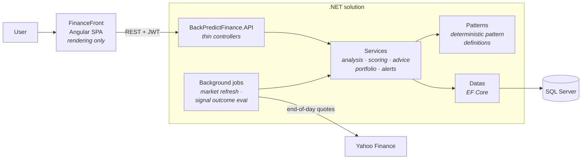

# PredictFinance

[](https://github.com/greg032deMentque/PredictFinance/actions/workflows/ci.yml)

**An educational investment-analysis tool for beginner retail investors, covering French listed equities.**

PredictFinance helps someone new to investing understand *why* a stock looks the way it does — not by telling them what to buy, but by showing which technical patterns it detects, how it scores them, and what the plausible scenarios are. Every conclusion is explainable and traceable back to the rule that produced it.


> **Screenshot needed** — drop a real capture of the analysis view at `docs/screenshot.png`.

---

## What it does

- **Watchlist and portfolio** — track French equities, record transactions, follow positions over time.
- **Daily technical analysis** — detects chart patterns on end-of-day data and produces an explainable signal rather than an opaque verdict.
- **Scenario guidance** — presents plausible outcomes with the reasoning behind them, so the user learns to read the setup instead of following a recommendation blindly.
- **PEA eligibility and fundamentals** — scores instruments against the rules of the French *Plan d'Épargne en Actions* tax wrapper.
- **Built-in learning layer** — glossary, FAQ and topic content, so an unfamiliar term is always one click from a definition.
- **Alerts and signal history** — past signals are re-evaluated after the fact, so the user can see whether they actually played out.

---

## Architecture

The backend owns all business truth. The frontend is a rendering and orchestration layer — it never re-derives a business decision. This split is deliberate: analysis rules, thresholds and scoring must have exactly one home, and it has to be the one that is tested.



| Component | Role |
|---|---|
| `BackPredictFinance.API` | HTTP delivery only — thin controllers, no business logic |
| `BackPredictFinance.Services` | Business logic, organised by capability (analysis, scoring, advice, portfolio, alerts, admin) |
| `BackPredictFinance.Patterns` | Deterministic chart-pattern definitions behind a registry |
| `BackPredictFinance.Datas` | EF Core entities, `DbContext`, migrations |
| `BackPredictFinance.ViewModels` | Request/response DTOs and AutoMapper profiles |
| `BackPredictFinance.Common` | Cross-project shared primitives |
| `BackPredictFinance.Tests` | Unit and integration tests |
| `FinanceFront` | Angular SPA consuming the API |

---

## Tech stack

| Layer | Stack |
|---|---|
| Backend | .NET 10 (`net10.0`), ASP.NET Core |
| Persistence | EF Core 10.0.9, SQL Server |
| Auth | ASP.NET Core Identity, JWT bearer tokens |
| Mapping / logging / docs | AutoMapper 16.1.1, Serilog 4.3.1, Swashbuckle 10.2.1 |
| Tests | xUnit 2.9.3, Moq 4.20.72 |
| Frontend | Angular 21.2, TypeScript 5.9.3, RxJS 7.8 |
| Market data | Yahoo Finance (end-of-day quotes) |

---

## How the analysis works

**The engine is rule-based and deterministic. There is no machine learning in this project.** That is a design choice, not a shortcut: for a tool whose purpose is to *teach*, every output has to be explainable down to the threshold that triggered it. A model that cannot justify itself would defeat the point.

**Input** — end-of-day OHLC candles for French listed equities, fetched from Yahoo Finance by a scheduled background job (`MarketDataRefreshJob`) and persisted locally.

**Detection** — each pattern is a self-contained definition implementing `IAnalysisPatternDefinition`, resolved through `AnalysisPatternRegistry`. Four continuation patterns are currently implemented:

- Bull flag
- Bear flag
- Rectangle
- Symmetrical triangle

Thresholds and technical primitives are centralised (`PatternThresholds`, `PatternTechnicals`), so detection stays consistent across patterns and each one remains testable in isolation.

**Output** — a detected pattern is scored, assessed for risk, and turned into scenario-based guidance. Every analysis run is persisted as an artifact, so a past signal can be replayed and audited. `SignalOutcomeEvaluationJob` later revisits those signals to evaluate whether they actually played out.

---

## Getting started

**Prerequisites** — .NET 10 SDK · Node.js and npm · SQL Server (LocalDB or Express)

### Configuration

Secrets are never committed. Copy the template and fill it in:

```bash
cp FinanceBack/BackPredictFinance.API/appsettings.Development.json.example \
   FinanceBack/BackPredictFinance.API/appsettings.Development.json
```

Set `ConnectionStrings.DefaultConnection`, `JWTToken.Secret`, `ServerSalt` and the seeded account passwords. The file is gitignored. Generate the secrets with:

```bash
openssl rand -base64 64   # JWTToken.Secret
openssl rand -base64 32   # ServerSalt
```

Database migrations are applied automatically on startup.

### Backend

```bash
dotnet restore FinanceBack/BackPredictFinance.sln
dotnet build   FinanceBack/BackPredictFinance.sln
dotnet run --project FinanceBack/BackPredictFinance.API
```

### Frontend

```bash
npm install   --prefix FinanceFront
npm start     --prefix FinanceFront    # http://localhost:4200
npm run build --prefix FinanceFront
```

---

## Tests

```bash
dotnet test FinanceBack/BackPredictFinance.Tests/BackPredictFinance.Tests.csproj
```

36 test files, roughly 120 xUnit facts and theories, organised by domain and run in CI on every push and pull request.

| Area | Focus |
|---|---|
| `Api` | Endpoint integration tests through a `WebApplicationFactory` harness |
| `Analysis` | Pattern scenario generation and analysis behaviour |
| `Portfolio` | Holding and position calculations |
| `Authentication` | Identity and JWT flows |
| `MarketData` | Quote ingestion, including concurrent candle upserts |
| `Alerts` · `Data` · `Admin` | Alerting rules, persistence, back-office governance |

The suite favours behavioural proofs over coverage padding: tests exist where a silent regression would otherwise go unnoticed — pattern detection, scoring, portfolio maths, concurrency.

---

## Scope

PredictFinance is deliberately narrow.

**It is** — French listed equities, end-of-day analysis, deterministic and backend-owned business truth, with the frontend as a rendering layer only.

**It is not:**
- a broker or execution platform — it places no orders
- a real-time trading terminal — analysis is daily, not intraday
- investment advice — it is an educational tool, and nothing it outputs is a recommendation to buy or sell

---

## Documentation

- [Known issues and technical debt](KNOWN_ISSUES.md)
- [`AGENTS.md`](AGENTS.md) — working contract for coding agents
- `Doc/` — product contracts and delivery documentation

## License

[MIT](LICENSE) © 2026 Grégoire de Mentque
